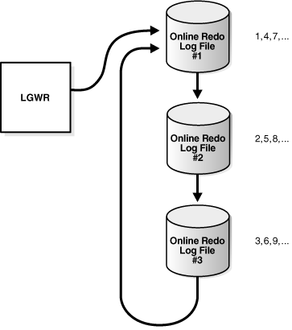
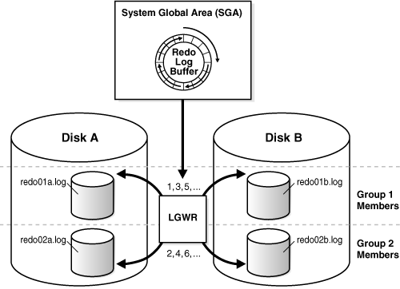

对恢复最至关重要的结构就是联机重做日志，它是由两个或更多预先分配的文件组成，记录对数据库所做的更改。联机重做日志记录对数据文件的更改。

== 联机重做日志的作用

数据库维护着联机重做日志以应对数据的丢失。具体说，在实例故障后联机重做日志文件让oracle数据库恢复那些已经提交但尚未写入数据文件的数据。

Oracle数据库将每个事务同步写入重做日志缓存，然后再写入重做日志文件。日志的内容包括未提交的事务、重做数据以及方案和对象管理语句。

Oracle数据库使用联机重做日志只是为了恢复。但是管理员可以通过ORACLE LOGMINER功能提供的一个SQL接口来查询重做日志文件。重做日志文件是关于数据库活动历史信息的有用来源。

== Oracle数据库如何写入联机重做日志

数据库实例的联机重做日志称为一个重做线程。在单实例配置下，只有一个实例存取一个数据库，所以只有一个重做线程。在oracle RAC配置下，两个或更多实例存取一个数据库，那么每个实例都有自己的重做线程。每个实例使用分离的重做线程避免了对联机重做日志文件的争夺。

一个联机重做日志由两个或更多联机重做日志文件组成。Oracle数据库要求至少有两个文件来保证其中一个在另一个被归档时总是可写的。

== 联机重做日志切换

Oracle数据库一次只使用一个联机重做日志文件来存储重做日志缓存中的记录。LGWR进程当前在写的重做日志文件称为当前联机重做日志文件。

日志切换在数据库停止写入一个联机重做日志而开始写入另一个时发生。正常情况下，在当前联机重做日志写满而必须继续写入的时候就会发生切换。但也可以配置日志在固定间隔发生切换，不管当前联机重做日志有没有写满。也可以进行强制手动切换。

LGWR循环地向联机重做日志文件中写入。当最后一个可用的联机重做日志文件写满时，进程又开始向第一个日志文件写入，重新开始循环。如下图：

图中的数字显示了LGWR写入每个联机重做日志文件的顺序。数据库在日志切换时给每个文件分配一个新的日志顺序号然后开始写入。当数据库重新使用一个联机重做日志文件时，这个文件会获取到下一个可用的日志顺序号。
写满的联机重做日志文件可否开始重用取决于归档模式：

* 如果没有启用归档模式，也就是 `NOARCHIVELOG` 模式，那么写满的重做日志文件会在其中记录的更改被DBWn checkpointed（写入）到磁盘中后可用；

* 如果启用了归档模式，也就是 `ARCHIVELOG` 模式，那么写满的重做日志文件要在其中的记录被写入数据文件并且归档后才可用。

在一些情况下，LGWR可能被禁止重用一个已存在的联机重做日志文件。例如，一个联机重做日志文件可能是 *active*（实例恢复需要的），而不是 *inactive*（实例恢复不需要了）。

== 多副本联机重做日志文件

Oracle数据库可以自动维护两个以上相同的重做日志副本，并放置在不同的地点。一个联机重做日志组由一个联机重做日志文件和它的多个副本组成。每个相同的副本都是联机重做日志组的一个成员。每个组都有一个组号，如组1、组2等等。

维护一个联机重做日志组的多个成员能够防止重做日志的丢失。建议将成员放置在不同的磁盘上，这样单个磁盘的故障不会导致所有重做日志的丢失。

下图中，A_LOG1和B_LOG2是组1的两个相同的成员，A_LOG2和B_LOG2是组2的两个相同的成员。组中的每个成* 都必须是相同大小的。LGWR同步地写入组1，然后同步写入组2，然后再写入组1……。LGWR绝不会向不同组中的成员同时写入。

== 归档重做日志

一个归档重做日志文件是一份写满的联机重做日志组成员的拷贝。这个文件不属于数据库的一部分，而是由数据库创建的联机重做日志文件的脱机拷贝，然后写到一个用户指定的位置。

归档重做日志文件是备份和恢复策略的重要部分。可以使用归档重做日志文件来：

* 	恢复一个数据库备份。
* 	更新备机
* 	使用 `LOGMINER` 功能来获取数据库历史信息。

归档是生成一个归档重做日志文件的操作。可以手动进行也可以自动进行，但只能在归档模式下。

一个归档重做日志包含了重做记录和联机重做日志组内成员的日志顺序号。如果数据库在归档模式下，启用自动归档，那么归档进程（*ARCn*）将归档组中的一个成员。

== 联机重做日志的结构

联机重做日志文件包含了重做记录。一个重做日志由一组更改容器组成，每个容器描述了对一个数据块的更改。例如，一个对employees表中的薪资的更新会生成一个重做记录，描述了表中数据段块、撤销段块以及撤销段事务表的更改。

重做记录包括如下内容：

*	SCN以及更改的时间戳
*	生成更改的事务的ID
*	事务提交的SCN和时间戳（如果提交了）
*	做出更改的操作类型
*	更改的数据段的名称和类型。
