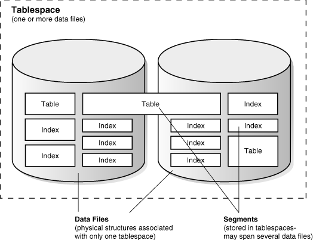
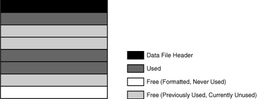

在操作系统级别，oracle数据库将数据库数据存储在数据文件中。每个数据库必须有至少一个数据文件。

== 数据文件的使用

为了方便管理，oracle数据库在表空间中为用户数据分配空间，表空间和段一样是逻辑存储结果。每个段都只属于一个表空间。例如，一个非分区表的数据存储在一个单独的段中，存储在一个表空间中。

Oracle数据库将表空间数据物理地存储在数据文件中。表空间和数据文件关系紧密，但有着重要的区别：

* 每个表空间由一个或多个数据文件组成。
* 数据库的数据集中存储在每个表空间的数据文件中。
* 一个段可以跨越一个或多个数据文件，但不能跨表空间。
* 一个数据库必须有 `SYSTEM` 和 `SYSAUX`表空间。Oracle数据库自动在创建数据库时首先为 `SYSTEM` 表空间创建数据文件。
+
`SYSTEM` 表空间包含了数据字典——一系列包含数据库元数据的表。通常来说，一个数据库也会有一个撤销表空间和一个临时表空间。

下图显示了表空间、数据文件和段之间的关系：

== 永久和临时数据文件

永久表空间包含永久方案对象。永久表空间中的对象存储在数据文件中。

临时表空间只在会话期间包含方案对象。本地管理的临时表空间有临时文件，它是一种特殊的文件，用来存储哈希、排序以及其它一些操作的数据。在内存空间不足的情况下，临时文件也会保存结果集。

本地管理的临时表空间拥有临时数据文件，除了以下几点，跟普通的数据文件相似：

* 永久性数据库对象，如表，不会存储在临时文件中。
* 临时文件总是在 `NOLOGGING` 模式，就是说，它们是不会生成重做记录的。介质恢复也无法识别临时文件。
* 无法使临时文件只读
* 不能用 `ALTER DATABASE` 语句创建临时文件
* 当创建或改变临时文件的大小时，并不保证指定文件大小的空间被分配。在某些文件系统中，如 `LINUX` 和 `UNIX`，临时文件是以稀疏文件的形式创建的。这种情况下，磁盘块并不是在文件创建或改变大小时分配，而是在第一次访问块时再分配
* 临时文件的信息展现在字典视图 `DBA_TEMP_FILES` 和动态性能视图 `V$TEMPFILE` 中，而不是在 `DBA_DATA_FILES`和 `V$DATAFILE` 。

== 联机和脱机数据文件

每个数据文件要么是在线（可用）要么是离线（不可用）。可以在任意时间将表空间脱机或联机来更改单个数据文件的可用性，除了 `SYSTEM` 表空间。脱机的数据文件无法访问，除非将其重新联机。

管理员将数据文件脱机可能有很多原因，包括进行脱机备份、重命名一个数据文件，或者块损坏。数据库会在数据文件无法写入时自动将其脱机。

表空间也能像数据文件一样脱机或联机，可以在表空间仍联机的情况下将数据文件脱机。也可以通过将表空间暂时脱机的方法将其所有数据文件脱机。

== 数据文件的结构

Oracle数据库通过分配特定数量的磁盘空间加上数据文件头专用的overhead来为一个表空间创建一个数据文件。Oracle数据库运行的操作系统负责在将一个文件分配给数据库之前清除陈旧的信息和授权。

数据文件头包含了数据文件相关的元数据，比如它的大小和检查点SCN。每个头部包含了一个绝对文件号和一个相对文件号。绝对文件数在数据库中唯一标识了数据文件。相对文件数则在表空间中唯一。

当oracle数据库创建一个数据文件时，分配的磁盘空间会被格式化，但是不会包含任何用户数据。但是数据库会保留空间来保存相关表空间中段的数据。随着表空间中数据的增长，oracle数据库用数据文件中的空闲空间来为段分配区。

下图显示了一个数据文件中不同类型的空间。区要么是已用——也就是包含了段数据，要么是空闲——可以使用。另外，随着时间的推进，在表空间中的更新和删除对象可能产生一些比较小的空闲空间，它们不够用作新数据的存储，这种类型的空闲空间叫做碎片空闲空间。

