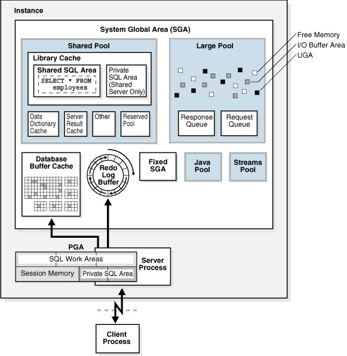
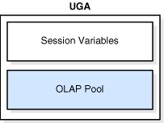
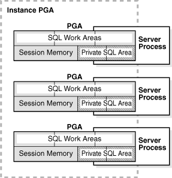
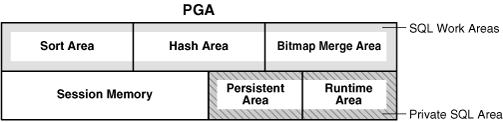
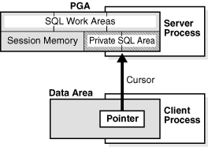
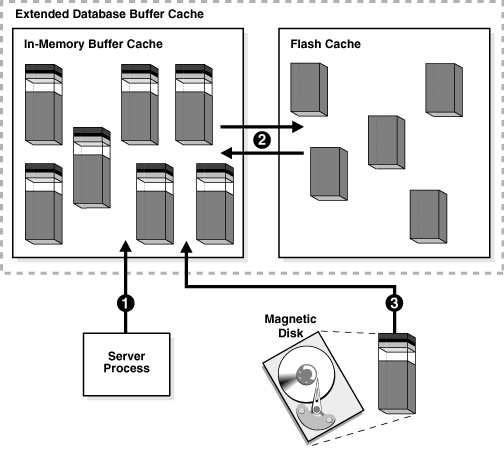
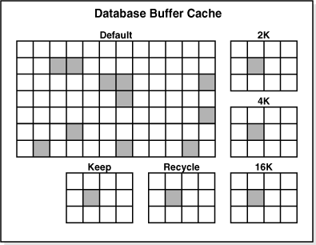
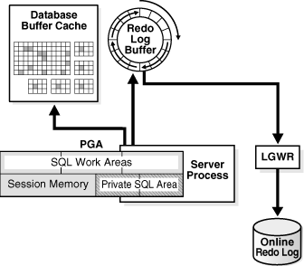
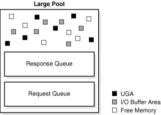

:toc:

= 内存架构

== Oralce内存架构简介

当一个实例启动后，oracle数据库会分配一块内存区域，启动一些后台进程。内存区域中储存了很多信息，例如：

*	程序代码
*	每一个连接的会话的信息，即使这个会话当前是不活动的
*	程序执行时需要的信息，例如某个查询的当前状态
*	进程间分享和交互的信息，例如锁信息
*	缓存数据，例如数据块和重做记录

=== 基础内存结构

Oracle数据库相关的基本内存结构包括：

* 系统全局区（SGA）
+
SGA是一组共享内存结构，称为 *SGA组件*，它包含了一个oracle数据库实例所需的数据和控制信息，SGA由所有服务进程和后台进程共享。举例来说，SGA中储存的数据包括缓存的数据块和共享SQL区。

*	程序全局区（PGA）
+
PGA是非共享区，是由单个oracle进程独占的，包含了进程所需的数据和控制信息。当一个oracle进程启动时，oracle数据库就会为它创建PGA。
+
每个服务器进程和每个后台进程都有各自的PGA。所有单个PGA的集合称为 *实例PGA* 或 *实例总PGA*。数据库初始化参数可以设置实例PGA的总大小，不能设置单个PGA的大小

* 用户全局区（UGA）
+
UGA是和某个用户会话相关联的内存区域。

* 软件代码区
+
软件代码区是用来存储正在运行或者可以被运行的代码的内存部分。Oracle数据库代码被存储在软件代码区，这是和用户程序存储的位置不同的，它是一个更独占或受保护的地点。

=== Oracle 数据库内存管理

随着数据库的变化，需要维护oracle实例内存结构，让其保持较优化的大小，这就是 *内存管理* 涉及的内容。Oracle数据库基于内存相关的初始化参数来管理内存。内存管理的基本选项有：

* 自动内存管理
+
我们指定实例内存的目标大小。数据库实例自动在SGA和实例PGA间按需重新分配内存。

*	自动共享内存管理
+
这种管理模式是半自动化的。我们设定SGA的目标大小，然后设定PGA的总大小或者分别管理PGA工作区。

* 手动内存管理
+
我们通过手动设定许多初始化参数来分别管理SGA和实例PGA。

如果使用DBCA来创建一个数据库然后选择基本安装选项，那么默认是自动内存管理模式。

== UGA

UGA是会话内存，是为会话变量，如登陆信息，以及其他数据库会话所需信息分配的内存。本质上讲，UGA储存了会话状态，如下图：

如果一个会话将一个PL/SQL包读入内存，那么UGA会包含包的状态，那是在特定时间保存在包中所有变量里的值的集合。包的状态会在一个包的子程序更改它的变量时发生变化。默认情况下，包变量在会话的生命周期里是唯一并持久存在的。

OLAP页池也存储在UGA中。这个池管理OLAP数据页，这是和数据块相同的东西。页池在OLAP会话启动时分配，会话结束时释放。OLAP会话在用户查询一个多维对象时会自动打开。

UGA必须在会话生命周期内对会话可用。因此，在使用共享服务连接时UGA不能被存储在PGA中，因为PGA是和单个进程相对应的。因此，UGA会被存储在SGA中，允许任何共享服务器进程读取它。当使用专享服务器连接时，UGA存储在PGA中。

== PGA

PGA 是操作中的进程或线程特有的内存，它不能被系统中其他进程或线程共享，因此它从不被分配在SGA中。

PGA是一个内存堆，它包含了专享或共享服务器进程所需的依赖于会话的变量。服务器进程在PGA中分配它所需的内存结构。

PGA就像一个文件办事员的临时工作台，办事员就是为客户端进程提供服务的服务器进程，办事员将台面清空，然后将客户请求的细节保存在工作台，然后再将用户的请求进行排序，最后在工作完成时清除。

下图显示了一个实例PGA。可以用一个初始化参数来设定实例PGA的目标最大值。单独的PGA可以在不超过最大值的情况下进行增长。

=== PGA 的内容

PGA被分割成不同的区域，每个区域都有不同的用途。下图显示了一个专享服务器会话所需的PGA的可能内容，这些内容不是所有情况下都全部存在的。

==== 私有SQL区

*私有SQL区* 保存了一个已解析的SQL语句的信息以及进程所需的其他会话专有信息。当一个服务器进程执行SQL或者PL/SQL代码时，进程会使用私有SQL区来储存绑定变量值、查询执行状况信息以及查询执行工作区。

不要将私有SQL区和UGA相混淆，也不要同在SGA中储存着执行计划的共享SQL区混淆。同一个或多个会话中的多个私有SQL区可以指向SGA中的一个执行计划。例如，一个会话中执行20次 `SELECT * FROM EMPLOYEES` 和两个不同会话中各执行10次可以共享相同的执行计划。每次执行的私有SQL区并不共享，并且可能包含不同的值和数据。

游标是标示私有SQL区的一个名字或句柄。如下图，可以将一个游标想象成客户端的一个指针和服务端的一个状态。

一个私有SQL区又被分割成如下部分：

* 运行时区
+
这个区包含了查询执行状态信息。例如，它会跟踪在全表浏览时已获取的行数。
+
Oracle数据库将创建运行时区作为执行请求的第一步。对于DML语句，运行时区会在SQL语句关闭时释放。

* 持久化区
+
这个区包含了绑定变量值。绑定变量值是在语句执行时提供给SLQ语句运行用的。这个区只在游标关闭时才释放。

客户端进程负责管理私有SQL区。私有SQL区的分配和回收很大程度上取决于应用，尽管一个客户端进程可以分配的私有SQL区数是由初始化参数OPEN_CURSORS限制的。

尽管大多数用户依赖于数据库的自动游标处理功能，oracle数据库编程结构为开发者提供了对游标更多的控制。总的来说，应用应该在游标不需要再次使用时关闭游标，来释放持久化区，减少应用用户的内存需求。

==== SQL工作区

工作区是PGA内存中用来进行一些有内存需求操作的私有分配区。例如，排序操作会用到排序区来排序一系列行。相似的，一个hash连接操作使用hash区来从它的左输入构建一个hash表，而位图融合使用位图融合区来融合从多个位图索引中浏览获取的数据。

下面的例子显示了 `employees` 和 `departments` 表的连接查询以及其查询计划。

[source,sql]
----
SQL> SELECT *
  2  FROM   employees e JOIN departments d
  3  ON     e.department_id=d.department_id
  4  ORDER BY last_name;
.
.
.
----------------------------------------------------------------------------------
| Id  | Operation           | Name        | Rows  | Bytes | Cost (%CPU)| Time    |
----------------------------------------------------------------------------------
|   0 | SELECT STATEMENT    |             |   106 |  9328 |    7  (29)| 00:00:01 |
|   1 |  SORT ORDER BY      |             |   106 |  9328 |    7  (29)| 00:00:01 |
|*  2 |   HASH JOIN         |             |   106 |  9328 |    6  (17)| 00:00:01 |
|   3 |    TABLE ACCESS FULL| DEPARTMENTS |    27 |   540 |    2   (0)| 00:00:01 |
|   4 |    TABLE ACCESS FULL| EMPLOYEES   |   107 |  7276 |    3   (0)| 00:00:01 |
----------------------------------------------------------------------------------
----

上面的例子中，运行时区跟踪全表浏览的进程。会话在hash区进行hash连接来匹配两个表中的行。ORDER BY 排序发生在排序区。

如果数据的量超过工作区承受的范围，那么oracle数据库会将输入的数据分割成更小的块。这样数据库能够在内存中处理一些数据碎片，而将其余的暂时存在磁盘中。

数据库在启用自动PGA内存管理时自动监控工作区的大小。也可以手动进行控制和监控。

总的来说，更大的工作区能够显著提升一个操作的性能，代价则是更高的内存消耗。最优情况是，工作区的大小足够容纳输入数据和与它相关联的SQL操作符分配的内存结构。如果不够的话，由于部分输入数据需要缓存到磁盘上，所以会增加响应时间。极端的情况下，工作区相对于输入数据而言太小了，那么数据库必须进行多次数据碎片的传递，这将显著增加响应时间。

=== 专享和共享服务器模式下的PGA

PGA内存的分配依赖与数据库使用的是专享模式还是共享模式，下表显示了区别：

|===

|内存区域|专用模式|共享模式

|会话内存的性质
|私有的
|共享的

|持久化区的位置
|PGA
|SGA

|运行时区的位置
|PGA
|SGA

|===

== SGA

SGA是一块可读可写的内存区域，和oracle后台进程一起组成了一个数据库实例。所有代表用户执行的服务器进程都可以在实例SGA中读取信息。有很多进程都会在数据库操作过程中写入SGA。

每个数据库实例都有自己的SGA。Oracle数据库自动在实例启动时为SGA分配内存并在实例关闭时回收内存。当使用SQL*Plus或者OEM启动一个实例时，SGA的大小就像下面的例子一样显示出来：

[source,sql]
----
SQL> STARTUP
ORACLE instance started.

Total System Global Area  368283648 bytes
Fixed Size                  1300440 bytes
Variable Size             343935016 bytes
Database Buffers           16777216 bytes
Redo Buffers                6270976 bytes
Database mounted.
Database opened.
----

本章开头的地方已经看到，SGA由许多内存模块组成，都是一些内存池，用来满足特定类型的内存分配请求。所有除了重做日志缓存SGA的模块，分配和回收空间的时候，都以称为粒度的连续内存为单位。粒度大小因平台不同并且由总SGA大小决定。

可以查询V$SGASTAT视图来获取SGA模块的信息。

=== 数据库数据缓存

数据库数据缓存是存储着从数据文件中读取的数据块拷贝的内存。缓冲区是缓冲区管理器暂时缓存当前或最近使用的数据块的一个主要内存地址。所有同时连接到数据库实例的用户都共享着访问数据缓存的权利。

Oracle数据库使用数据缓存来达到以下目的：

*	优化的物理I/O
+
数据库更新缓存中的数据块并且将关于更改的元数据存储到重做日志缓存中。在COMMIT之后，数据库将重做缓存写入磁盘但是并不立即将数据块写入磁盘，而是在后台由DBWn进行懒写入。

* 将频繁读写的块保留在缓存中而将不经常读写的块写入磁盘
+
当启用智能闪存时，部分数据缓存可以留在闪存中。这种缓存扩展存储在闪存磁盘设备上，数据库可以通过缓存在闪存中而不是磁盘中来提升性能。

==== 缓冲区状态

数据库使用内部算法来管理缓冲区。一个缓冲区可能会在以下几种状态之一：

* 未用
+
缓冲区可以使用，因为它还从未被使用过或当前未被使用。这种类型是数据库最方便使用的。

*干净
+
这个缓冲区之前被使用过，并且目前包含的数据块是在某个点读取一致版本的。块中包含了数据，但已经是干净的，所以就无需进行检查点操作。数据库可以pin数据块并且重用它。

* 脏
+
缓存中包含了已更改的数据，但还没有写入磁盘。数据库在重用它之前必须对块进行检查点操作。

每块缓存都有一个访问模式：pinned或空闲。Pinned的缓存在用户会话存取它的时候不会被挤出内存。多个会话不能同时修改一块pinned缓存。

数据库使用一套成熟的算法来使缓存存取更高效。指向脏和非脏缓存的指针存在于同一个LRU列表中，这个列表有一个热端和冷端。冷缓存是指最近没有使用的，热缓存是指频繁存取和最近使用的缓存。

==== 缓存模式

当一个客户端请求数据时，oracle数据库在下面的一种模式中从数据库缓存中获取数据：

* 当前模式
+
当前模式获取，也叫数据块获取，是获取数据块当前出现在缓存中的状态的数据。例如，如果一个未提交的事务更新了一个数据块中的两行，那么在当前模式获取中，会得到未提交行的数据块。数据库使用这种模式大多数是在更改语句过程中，这种操作必须更新的是数据块的当前版本。

* 一致模式
+
一致读获取是获取数据块的读取一致性版本，可能会使用撤销数据。例如，如果一个未提交事务更新了一个数据块中的两行，如果另一个会话中的一个查询请求这个数据块，那么数据库会使用撤销数据来创建一个不包含未提交更新的该数据块的读取一致的版本（称为一致读取克隆）。一般情况下，查询都获取的是一致模式下的数据块内容。

==== 缓存I/O

逻辑I/O，也叫缓存I/O，说的是写入或读取缓存。当一个请求的缓存没能在内存中找到，那么数据库就要进行物理I/O，从闪存或者磁盘中拷贝缓存内容到内存中，然后使用逻辑I/O来读取它。

===== 缓存写

DBWn定期将老的脏的缓存内容写入磁盘。DBWn在以下几种情况下会写入缓存：

* 一个服务器进程需要将新块读入数据缓存时，无法找到干净的缓存。
+
随着缓存的变脏，空闲缓存的数量逐渐减少，如果减少到一个门槛以下，并且仍需要使用干净的缓存，那么服务器进程就会通知DBWn进行写入操作。
+
数据库使用LRU来决定将哪些脏缓存写入。当脏缓存达到LRU的冷端时，数据库会将其移出LRU移到一个写入队列中。DBWn将队列中的缓存写入磁盘，并且在可能的情况下进行多块写入。这种机制能够防止LRU被脏缓存阻塞住，让干净的缓存能够被找到并重用。

* 数据库必须推进检查点时。
* 表空间被变成只读或离线状态时。

===== 缓存读

当干净或未用的缓存量很少时，数据库必须将缓存从缓冲区中移除，这个算法取决于是否使用了闪存：

* 未启用闪存：
+
数据库按需重用每个干净的缓存，覆盖它。如果被覆盖的缓存后面又需要用到，那么数据库就需要重新将其从磁盘中读取到缓冲区。

* 启用闪存：
+
DBWn可以将一个干净缓存的body写入闪存，启用它的内存中缓存重用。数据库将缓存头留在LRU列表中，以便跟踪body在闪存中的状态和位置。如果这个缓存稍后需要用到，那么数据库就可以从闪存而不是磁盘中读取。

当一个客户端进程请求缓存时，服务器进程会搜索缓冲区。如果数据库在内存中找到该缓存，称为缓存命中。搜索顺序如下：

.	服务器进程在缓冲区中搜索整个缓存。
+
如果进程找到整个缓存，那么数据库执行逻辑读

.	服务器进程在闪存LRU列表里搜索缓存头。
+
如果进程找到缓存头，那么数据库执行优化物理读取，将闪存里的缓存体读入内存缓存中。

.	如果进程没有在内存中找到缓存（缓存未命中），那么服务器进程执行如下步骤：

.. 将数据块从数据文件中读入内存（物理读）

.. 对读入内存的缓存执行逻辑读

下面的图说明了这种缓存搜索顺序。扩展的缓冲区不仅包括内存中的整个缓存，也包括只包含缓存体的闪存。图中，数据库先在缓冲区搜索缓存，没有找到，然后从磁盘中将其读入内存。

===== 缓存接触量

数据库使用缓存接触量来度量LRU列表中缓存的存取频率。这种机制让数据库可以在缓存被PIN的时候增加接触量，而不是持续地拖动LRU列表中的缓存。

当一个缓存被PIN的时候，数据库会决定它的接触量是不是刚被增加过。如果在3秒之前增加的，那么增加其接触量，否则，接触量不变。这种3秒规则能够防止在一块缓存上爆发的PIN增加过多的接触量。例如，一个会话可能在一个数据块中插入了很多行，但是数据库会将这些插入认为是一次接触。

如果一个缓存在LRU的冷端，但它的接触量很高，那么缓存会移动到热端。如果接触两较低，那么缓存会淡出缓冲区。

===== 缓存和全表浏览

当缓存必须从磁盘中读取时，数据库将缓存插入LRU列表的中间。这种方式下，较热门的块可以保持在缓冲区中的位置，也就不需要再从磁盘中读取。

有一个问题会在全表浏览时暴露出来，全表浏览需要频繁地读取低于高水位线的所有行，假设一个表段中的块的总大小大于缓冲区的大小，进行该表的全表浏览就会清空整个缓冲区，让数据库无法将最近存取的数据块保持在缓冲区中。

由于进行一个大表的全表浏览而被读入缓冲区的数据块会被区别对待，数据块会立即可以重用来防止全表浏览清空缓冲区。

==== 缓存池

缓存池是缓存的集合。数据库缓冲区被分割成一个或多个缓存池。

可以手动配置分隔的缓存池，以便实现在数据缓冲区中保留数据或者使数据缓冲区在其中的数据块被使用后可以立即写入新数据。用户可以指定方案多使用相应的缓冲池，以便控制数据被移出缓冲区的时机。

* 默认池
+
这个池是数据块通常被缓存的地方，除非手动配置多个缓存池，否则默认池就是唯一的缓存池。

* 保留池
+
这个池是为存取频繁的块准备的。

* 回收池
+
这个池是为存取不频繁的块准备的，回收池能够避免不必要的消耗缓冲区的空间。

数据库会有一个默认块大小，可以创建一个使用非标准块大小的表空间。每个非默认的块大小都有它自己的池。Oracle数据库管理这些池中的块，就像它们在默认池中一样。

下图显示了使用多个池时的缓冲区的结构，缓冲区包含了默认池、保留池和回收池。默认块大小是8KB，缓冲区还还包含了使用2KB、4KB、16KB块大小的表空间所需的额外的池。

=== 重做日志缓存

重做日志缓存是SGA中的循环式缓存，它保存了描述对数据库所做改变的记录。重做记录包含了重构或重做对数据库所做改变所需的信息。数据库恢复向数据文件提供重做记录来重构丢失的改变。

Oracle数据库进程从用户内存空间将重做记录拷贝到SGA中的重做日志缓存里。重做日志占据缓存中顺序连续的空间。后来进程LGWR将重做日志缓存写入磁盘上的活动在线重做日志组。下图显示了重做缓存的活动：

LGWR在DBWn分散地将数据块写入磁盘时将重做记录按顺序写入磁盘。分散写入是比顺序写入慢的。由于LGWR让用户避免了等待DBWn的缓慢写入，数据库可以提供更好的性能。

=== 共享池

共享池缓存了各种程序数据。例如，共享池储存已解析的SQL语句、PL/SQL代码、系统参数以及数据字典数据。几乎数据库中发生的每个操作都涉及到共享池。例如，如果一个用户执行了一句SQL语句，oracle数据库就会访问共享池。

共享池被分割为很多子部件，其中最重要的如下图：

image:./shared_pool.gif[]

==== 库缓存

库缓存是共享池内存中用来储存可执行的SQL语句和PL/SQL代码的。缓存包含了共享SQL区和PL/SQL区，以及控制结构，如锁和库缓存句柄。在共享服务器架构下，库缓存还包含了私有SQL区。

当一个SQL语句被执行时，数据库会尝试重用过去的已执行代码。如果一个已解析的SQL语句在库缓存中存在并且可以被共享，那么数据库会重用它，这叫做软解析或命中库缓存。否则，数据库必须为其建立一个新的可执行版本，称为硬解析或未命中库缓存。

==== 共享SQL区

数据库将其运行的每个SQL语句体现在下面的SQL区：

* 共享SQL区
+
在SQL语句第一次出现时，数据库使用共享SQL区进行处理。这个区对所有用户都是可访问的，并且它包含了语句解析树和执行计划。一个唯一的语句仅有一块共享SQL区对应。

*	私有SQL区
+
每个执行SQL语句的会话都会在其PGA中拥有一块私有SQL区。每个提交相同语句的用户都拥有一块私有SQL区，它指向相同的共享SQL区。因此，PGA中许多私有SQL区可以和相同的共享SQL区相对应。

数据库会自动决定何时应用程序提交了相似的SQL语句。数据库不仅会考虑用户和应用程序直接执行的SQL语句，还会考虑语句内部递归执行的SQL语句。

数据库进行如下步骤：

.	检查共享池，看是否存在语法和语义都相同的语句共享SQL区：

* 如果存在，那么数据库使用共享SQL区来执行语句，因此也降低了内存消耗
* 如果不存在，那么数据库在共享池中分配一块新的共享SQL区。拥有相同语法但不同语义的语句会使用子游标。

+
不管在哪种情况下，用户的私有SQL区都指向包含语句和执行计划的共享SQL区。

.	为会话分配私有SQL区
+
私有SQL区的位置取决于建立会话的连接。如果会话是通过共享服务器连接的。那么一部分私有SQL区会放在SGA中。

下图显示出一个专享服务器模式下，两路会话将相同的SQL语句拷贝保存在他们自己的PGA中。在共享服务器模式，拷贝会放在UGA中，即大池或在大池不存在时保存在共享池中。

image::./private_sql_areas_and_shared_sql_area.gif[]

===== 程序单元和库缓存

库缓存保存着PL/SQL程序和JAVA类的可执行版本。这些东西统称为程序单元。

数据库处理程序单元和处理SQL语句相似。例如，数据库为已解析、编译的PL/SQL程序分配一块共享区。数据库为运行程序的会话分配一块私有区域来保存对会话很特殊的值，包括局部、全局、包变量，以及执行SQL的缓存。如果多个用户运行同一个程序，那么每个用户都维护着各自的私有SQL区，来保存值，同时存取同一块共享SQL区。

数据库处理PL/SQL程序单元内部的SQL语句也如上所述。尽管它们原来是在PL/SQL程序内部，它们同样还是会用到共享区和私有区。

===== 分配和重用共享池中的内存

数据库在一个新的SQL语句被解析时分配共享池内存。内存大小取决于语句的复杂度。

总体来说，在共享池中的内容会一直保留到根据LRU算法清除时为止。数据库允许共享池中由很多会话使用的内容一直保留，只要它们还有用，即使创建它们的进程已经终止。

如果需要为新内容分配空间，数据库会释放较不常用的内存。如果一块共享SQL区和一个一段时间没有使用过的已打开的游标相关联，数据库也有可能将其从共享池中移除。如果后续游标又再次使用，那么oracle数据库会重新解析语句并分配新的共享SQL区。

数据库在下列情况下也会将共享SQL区从共享池中移除：

* 如果为一个表、表簇或索引收集统计数据，那么默认情况下数据库会在一段时将后逐步将涉及到该对象的语句的共享SQL区移除。下次被移除的语句运行时，数据库在新的共享SQL区解析它以反映模式对象的新数据。

* 如果一个SQL语句中涉及到一个模式对象，并且对象后来被DDL语句修改了，那么数据库也会将其共享SQL区失效。

* 如果更改了全局数据库名，那么数据库会将共享池中的所有信息删除。

可以使用 `ALTER SYSTEM FLUSH SHARED_POOL` 语句来手动移除共享池中的所有信息，这样可以获取媲美重启实例的性能。

==== 数据字典缓存

数据字典是很多表和视图的集合，它们包含了数据库的相关信息，它的结构以及它的用户。Oracle数据库在解析SQL语句时频繁地读取数据字典内容。

Oracle数据库对数据字典十分频繁，所以为了保存数据字典信息，设计使用如下特殊的内存地点来保存：

.	数据字典缓存
+
保存了数据库对象的信息，也叫做行缓存，因为它将数据保存为行的形式。

.	库缓存

所有的服务器进程都共享这些缓存来获取数据字典信息。

==== 服务器结果缓存

不像缓存池，服务器结果缓存保存着结果集而不是数据块。它包括SQL查询结果缓存和PL/SQL函数结果缓存，它们共享着相同的基础结构。

客户端结果缓存与其不同。客户端缓存是在应用级配置的，并且使用的是客户端的内存，而不是数据库的内存。

===== SQL查询结果缓存

数据库可以将查询结果和查询片段储存在SQL查询结果缓存中，大多数应用都会从这个性能提升中获益。

例如，假设一个应用程序重复地巡行相同的SELECT语句。如果结果被缓存。那么数据库可以立即返回结果。这样数据库可以避免重复读取数据块和重复计算结果的昂贵代价。数据库自动将缓存置于无效，只要有事务更改了构成缓存结果的数据库对象的数据或元数据。

用户可以使用 `RESULT_CACHE` 提示来指示数据库应该将结果缓存起来。`RESULT_CACHE_MODE` 参数决定了是为所有查询进行结果缓存还是需要用户手动指定。

===== PL/SQL函数结果缓存

PL/SQL函数结果缓存保存了函数结果集。不缓存，在一秒对一个函数的1000个调用，每个调用会花掉1000秒。缓存，1000个相同输入的函数调用总共才需要1秒。

PL/SQL函数代码可以包含一个用来缓存其结果的请求。调用函数时，系统会检查缓存。如果缓存中包含了相同参数值的函数调用，那么系统直接返回缓存的结果而不再重新执行函数体。如果缓存中没有结果，那么系统执行函数体并在返回调用者结果前将这些参数值下的结果加入到缓存中。

缓存可以积聚许多结果----每个函数不同的参数值组合都有不同的结果。如果数据库需要更多内存，可以清掉一个或多个缓存结果。

===== 保留池

保留池是共享池中数据库可以用来分配大段连续内存的区域。

从共享池中分配内存是以大块的方式进行的。这样允许大型对象加载到缓存中，而不需单独的连续区域，可以避免由于内存碎片过多而缺少大块连续内存。

在极少数情况下，JAVA, PL/SQL或者SQL游标可能在分配大于5KB的空间时超出共享池。为了让这种分配更高效，数据库在共享池中隔离出少量空间用作保留池。

=== 大池

大池是一种可选内存区域，是用来分配那些大小不适合存储在共享池中的内存。大池可以为以下应用分配内存：

*	共享服务器的UGA以及oracle XA接口
*	语句并行执行用到的消息缓存
*	用于RMAN的I/O slaves的缓存

通过从大池中分配会话内存给共享SQL，数据库能够避免由于共享SQL缓存削减带来的性能消耗。通过在大池中分配内存给RMAN操作、IO服务器进程以及并发缓存，大池能够比共享池更好地满足大型的内存需求。

大池与共享池中的保留池不同，共享池中的内存中使用的是相同的LRU列表。而大池没有LRU列表。内存片段被分配后直到被使用完是不能释放出来的。

=== Java 池

Java池是用来存储会话特定的Java代码以及JVM内部数据的内存区域。这些内存包含了调用结束后要移植到Java 会话中的Java对象。

对于专享服务器连接，java池包含了每个java类的共享部分、包含了方法和只读内存，如代码容器，而不是每个会话的session级 Java状态。对于共享服务器连接，java池包含了每个类的共享部分，每个会话的状态所用到的一些UGA。每个UGA的大小会根据需要变化。但是总的UGA大小必须小于java池。

JAVA池顾问提供了为Java使用的库缓存内存的信息，并且预测Java池大小的更改将会如何影响解析率。Java池顾问在 `STATISTICS_LEVEL` 设置为 `TYPICAL` 或更高时会打开。这些数据会在顾问关闭时重置。

=== 流池

流池储存了缓存的队列消息，并且为oracle流捕捉进程和应用进程提供内存。流池是由oracle流专享的。

=== 固定 SGA

Fixed SGA是内部区域。例如，它包括：

* 后台进程需要获取的数据库和实例的总体状态信息。
* 进程间交互的信息，例如锁。

它的大小是由oracle数据库设定的并且无法手动更改。

== 软件代码区

软件代码区用来存储正在运行或可以运行的代码。Oracle数据库代码存储的地方要比存储用户程序的地方更安全。

软件区通常是大小不变的，只会在软件升级或重装时改变。这些区域的大小是根据操作系统的不同而不同的。

软件区是只读的，并且可以在安装时决定共享或不共享。一些数据库工具和功能，如Oracle Forms和SQL*PLUS，是可以共享的，但有一些不行。如果可能，数据库代码就会被共享，以便用户无需再获取内存就可以进行读取，提升了整体性能。
