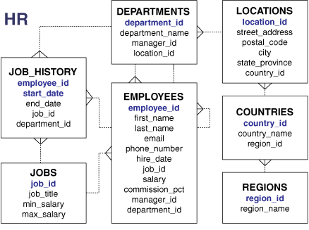

数据库模式（shema）是模式对象的逻辑容器。例如表和索引就是模式对象。模式对象由SQL语句创建和操纵。

数据库用户有一个密码以及各种数据库权限。每个用户都拥有一个模式，模式名与用户名相同。模式为它的拥有者保存数据。例如，用户 `hr` 拥有模式 `hr`，`hr` 模式包含了例如 `employees` 表的模式对象。在产品级数据库里，模式拥有者一般代表一个数据库应用。

在模式内，特定类型的每个模式对象都有一个唯一的名字。例如，`hr.employees` 说的的是 `hr` 模式里的 `employees` 表。下图显示了一个由 `hr` 拥有的模式，以及 `hr` 模式内的模式对象。

== 模式对象类型

关系数据库中最重要的模式对象就是表。表以行的形式保存数据。

Oracle SQL让我们可以创建和操纵许多其他类型的模式对象，包括：

* 索引
+
索引是为表中每个索引的行保存记录的模式对象，能够提供对行数据更快速直接的访问。Oracle数据库支持很多类型的索引。索引表是一种将数据以索引结构存储起来的表。

* 分区
+
分区是大型表和索引的分片。每个分区都有自己的名字，可能还会有自己的存储特性。

* 视图
+
视图是对一个表或多个表或者其它视图中数据的一个定制展现。视图并不实际包含数据。

* 序列
+
序列是用户创建的对象，用来生成证书，可以由多个用户共享。一般情况序列用来生成主键值。

*	度
+
度定义了列之间的父子关系（列必须是同一个表的列）。度常被用来整理例如用户、产品和时间等等数据。

* 同义词
+
同义词是对其他模式对象的别名。由于只是别名，所以除了数据字典以外不占其它存储空间

* PL/SQL子程序和包
+
PL/SQL是对SQL的过程级扩展。PL/SQL子程序是一个命名的PL/SQL块，可以带一些参数来调用。PL/SQL包可以将PL/SQL类型、变量和子程序逻辑关联起来。

其它一些存储在数据库中的对象也可以用SQL语句进行创建和控制，但它们并不属于某一个模式。这些对象包括数据库用户、角色、上下文和目录对象。

== 模式对象的存储

一些模式对象将数据存储在段中，例如，一个普通表或索引会创建一个段。其他模式对象，例如视图和序列，仅由元数据组成。这部分只描述那些有段的模式对象。

Oracle数据库将模式对象逻辑地存储在表空间中。模式和表空间之间没有关系：一个表空间可以包含不同模式的对象，一个模式的对象也可以放在不同的表空间里。每个对象的数据都被物理地存储在一个或多个数据文件中。

下图显示了表和索引段、表空间以及数据文件的可能配置情况。一个表的数据段跨越了两个数据文件，而这两个数据文件都是同一个表空间的一部分。一个段是不能跨越多个表空间的。

== 模式对象依赖

一些模式对象会引用其他对象，创建模式对象依赖。例如，视图包含一个引用其他表或其它视图的查询，一个PL/SQL子程序会调用其他子程序。如果A的定义中引用了B，那么A是依赖对象，B是被引用对象。

Oracle数据库提供了一个自动机制来保证依赖对象总是跟它的引用对象保持一致。当一个依赖对象被创建时，数据库会跟踪它们之间的依赖性。当被引用对象发生变化时，可能会影响到依赖对象，那么依赖对象会被标记为非法。例如，如果用户删除了一个表，那么基于这个表的视图都不可用。

一个非法的依赖对象必须在其不可用之前对引用对象的新定义进行重新编译，重编译会自动发生在依赖对象被引用时。

下面的示例脚本创建了一个表 `test_table`，然后创建了一个查询这个表的过程。

[source,sql]
----
CREATE TABLE test_table ( col1 INTEGER, col2 INTEGER );

CREATE OR REPLACE PROCEDURE test_proc
AS
BEGIN
 FOR x IN ( SELECT col1, col2 FROM test_table )
 LOOP
   -- process data
   NULL;
 END LOOP;
END;
/
----

下面查询 `test_proc` 的状态，显示它是否合法：

[source,sql]
----
SQL> SELECT OBJECT_NAME, STATUS FROM USER_OBJECTS WHERE OBJECT_NAME = 'TEST_PROC';

OBJECT_NAME STATUS
----------- ------
TEST_PROC   VALID
----

在添加 `col3` 列到 `test_table` 中后，过程仍是合法的因为这个过程在这个列上没有依赖。

[source,sql]
----
SQL> ALTER TABLE test_table ADD col3 NUMBER;

Table altered.

SQL> SELECT OBJECT_NAME, STATUS FROM USER_OBJECTS WHERE OBJECT_NAME = 'TEST_PROC';

OBJECT_NAME STATUS
----------- -------
TEST_PROC   VALID
----

但是，更改 `col1` 列的数据类型后，再验证这个过程：

[source,sql]
----
SQL> ALTER TABLE test_table MODIFY col1 VARCHAR2(20);

Table altered.

SQL> SELECT OBJECT_NAME, STATUS FROM USER_OBJECTS WHERE OBJECT_NAME = 'TEST_PROC';

OBJECT_NAME STATUS
----------- -------
TEST_PROC   INVALID
----

运行一下这个过程或者重编译它，可以让它重新合法：

[source,sql]
----
SQL> EXECUTE test_proc

PL/SQL procedure successfully completed.

SQL> SELECT OBJECT_NAME, STATUS FROM USER_OBJECTS WHERE OBJECT_NAME = 'TEST_PROC';

OBJECT_NAME STATUS
----------- -------
TEST_PROC   VALID
----

== `SYS` 和 `SYSTEM` 模式

所有oracle数据库都有默认的管理账号。管理账号有很高的权限，并且是倾向于仅用于授权的DBA们来进行诸如启动和停止数据库、管理内存和存储、创建和管理数据库用户等任务的。

管理账户 `SYS` 是在数据库创建的时候自动创建的。这个账户可以进行所有的数据库管理功能。`SYS` 模式为数据字典保存基础表和视图。这些基础表和视图对于oracle数据库的操作是至关重要的。`SYS` 模式中的表仅由数据本身操控，绝不能被任何用户更改。

`SYSTEM` 账号也是在数据库创建的时候自动创建的。`SYSTEM` 模式保存了另外的表和视图，用来显示管理信息，以及由这种数据库选项和工具所使用的内部表和视图。*不要* 用 `SYSTEM` 模式来存储非管理用户的表。

== 示例模式

Oracle数据库可能会包示例模式，是一些内部连接的模式，能够让oracle文档和oracle指导材料来演示普通的数据库操作。Hr模式时一个包含关于员工、员工、地点、工作历史等等信息的示例模式。

下图是一个hr模式中表的实体关系图。本手册中的大多数例子都使用这个模式中的对象。

